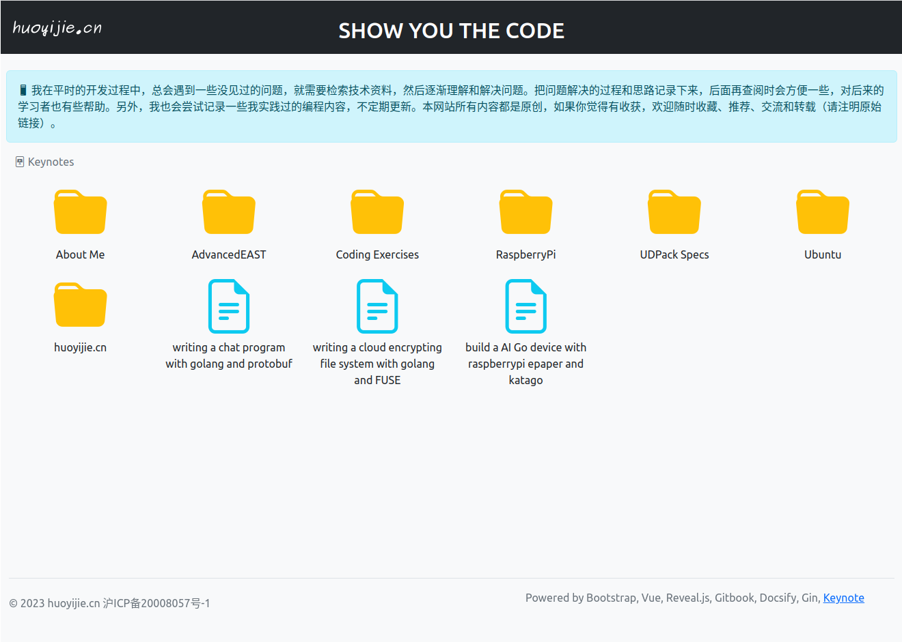

# Keynote

## Introduction

Keynote is a lightweight CMS (Content Management System) tool writing in Golang. It's based on Markdown and stands on top of [Gitbook](https://github.com/GitbookIO/gitbook), [Docsify](https://github.com/docsifyjs/docsify) and [Reveal.js](https://github.com/hakimel/reveal.js), and powered by Bootstrap and Vue. You can choose any of Gitbook/Docsify/Reveal.js to write docs or slides. If you like keynote, welcome to star or help.

[https://huoyijie.github.io](https://huoyijie.github.io) is my website built with Keynote.
[Here](https://huoyijie.github.io/keynote) is a demo.



## Prerequisites

* Go 1.20 及以上

* Gitbook

```bash
$ gitbook -V
CLI version: 2.3.2
GitBook version: 3.2.3
```

* Node.js v12.22.12

Gitbook depends on Node, `gitbook init` reports error with recently released Node, you'd better switch to Node v12.22.12 to build gitbook.

## Install

```bash
$ git@github.com:huoyijie/keynote.git

$ cd keynote

$ go install .
```

```bash
$ keynote -h
Usage of keynote:
  -base string
        base path of the static site (default "/")
  -conf string
        the config of the site (default "keynote.yaml")
  -gen
        generate static site
  -host string
        the host that server listen on (default "0.0.0.0")
  -output string
        where the generated files store (default ".")
  -port int
        the port that server listen on (default 8000)
  -pro
        production mode (without auto reload)
  -src string
        where the keynote sources store (default "src")
```

## Run with demo

```bash
$ cd docs
$ keynote -port 8000
```
You can open `http://127.0.0.1:8000`.

## Run with your repo

First, you can create a new repository with the name {your github id}.github.io, just like [huoyijie.github.io](https://github.com/huoyijie/huoyijie.github.io).

Clone the repo and write something.

```bash
$ cd xxx.github.io
$ ls -l
keynote.yaml
src
```

keynote.yaml is the conf, and src is the folder you put your markdown files.

In every folder under src, you must new a `.folder.yaml` file. You can open the example file and look at it.

### Run a server

```bash
$ cd xxx.github.com
$ keynote -port 8000
```

You can open `http://127.0.0.1:8000`.

### Generate static site

```
$ keynote -gen
```

## About gitbook

Gitbook will take a few more steps:

```bash
cd src
$ gitbook init gitbook-about-keynote
```

edit src/.folder.yaml

```yaml
keynote:
  - 'what-is-keynote.md'
gitbook:
  - 'gitbook-about-keynote'
docsify: []
ignore:
  - 'images'
```

```bash
$ cd src/gitbook-about-keynote
$ gitbook build ./ latest
```