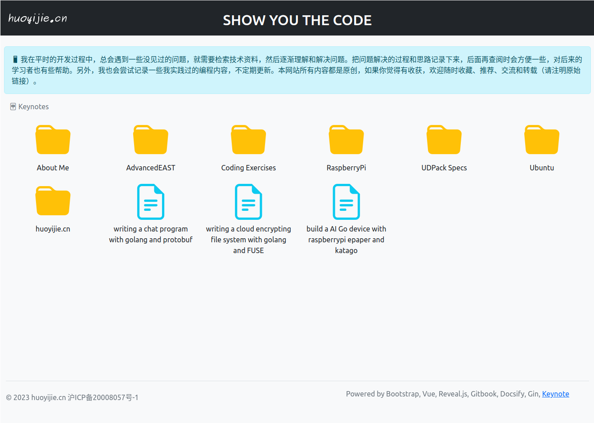

# Keynote

## Introduction

Keynote is a lightweight CMS (Content Management System) tool writing in Golang. It's based on Markdown and stands on top of [Gitbook](https://github.com/GitbookIO/gitbook), [Docsify](https://github.com/docsifyjs/docsify) and [Reveal.js](https://github.com/hakimel/reveal.js), and powered by Bootstrap and Vue. You can choose any of Gitbook/Docsify/Reveal.js to write docs or slides. If you like keynote, welcome to star or help.
---
[Here](https://huoyijie.github.io) is a demo built with Keynote.
---

---
## Prerequisites

* Go 1.20 及以上

* Gitbook

```bash
$ gitbook -V
CLI version: 2.3.2
GitBook version: 3.2.3
```

* Node.js v12.22.12

Gitbook depends on Node, `gitbook init` reports error with recently released Node, you'd better switch to Node v12.22.12 to build gitbook.
---
## Install

```bash
$ git@github.com:huoyijie/keynote.git

$ cd keynote

$ go install .
```
---
## Run with demo
```bash
$ cd docs
$ keynote -port 8000
```
You can open `http://127.0.0.1:8000`.
---
## Run with your repo

First, you can create a new repository with the name {your github id}.github.io, just like [huoyijie.github.io](https://github.com/huoyijie/huoyijie.github.io).

Clone the repo and write something.
---
```bash
$ cd xxx.github.io
$ ls -l
keynote.yaml
src
```

keynote.yaml is the conf, and src is the folder you put your markdown files.

In every folder under src, you must new a `.folder.yaml` file. You can open the example file and look at it.
---
### Run a server

```bash
$ cd xxx.github.com
$ keynote -port 8000
```

You can open `http://127.0.0.1:8000`.
---
### Generate static site

```
$ keynote -gen
```